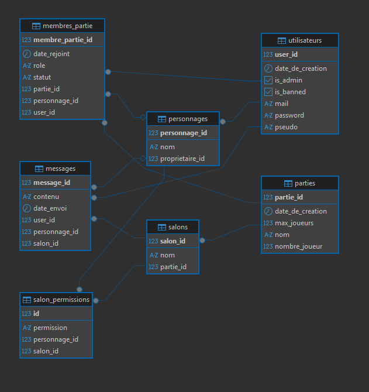

# JDR Server API

<p align="left">
  <a href="https://spring.io/projects/spring-boot" target="_blank"></a>
  <a href="https://www.docker.com/" target="_blank"></a>
  <a href="https://www.postgresql.org/" target="_blank"></a>
</p>

JDR Server API est une API REST créée pour la gestion de Jeux de Rôle.  
Cette application permet de gérer des utilisateurs, des personnages, des campagnes (parties) et un système de messagerie complet avec gestion de permissions par salon.

> [!WARNING]
> JDR Server API est toujours en cours de développement ! Vous serez sans doute confronté à certains bugs.

--------------------------------

## Schéma de la base de données



## Installation et lancement

Le projet est entièrement conteneurisé. Pour le lancer, il vous faut simplement [Docker](https://www.docker.com/get-started).

1. Clonez le dépôt.
   ```bash
   git clone https://github.com/Arckedo/jdr-server-api.git
   ```
  
3. À la racine du dossier `jdr_server`, lancez cette commande :

   ```bash
   docker-compose up --build
   ```
## Configuration de base

- Base URL : `http://localhost:8080/api`
- Format d'échange : `application/json`

> [!NOTE]
> Astuce pour faciliter les tests : Utilisez le fichier `api-test.http` pour tester facilement les endpoints depuis VS Code ou IntelliJ.

--------------------------------
# Documentation API

## Gestion des utilisateurs
> `BASE_URL/api/utilisateur`

| Méthode | Endpoint | Paramètres requis | Description |
|---------|----------|-------------------|-------------|
| POST | `/inscrire` | Body JSON : `pseudo`, `mail`, `password` | Crée un nouveau compte utilisateur |
| POST | `/connexion` | Body JSON : `mail`, `password` | Authentifie l'utilisateur |
| GET | `/pseudo/{pseudo}` | Path : `pseudo` (String) | Récupère un profil via son pseudo |
| GET | `/{id}` | Path : `id` (Long) | Récupère un utilisateur par son ID |
| PUT | `/{id}` | Path : `id` Body JSON : `pseudo`, `mail` (champs optionnels) | Modifie les informations du profil |
| DELETE | `/{id}` | Path : `id` | Supprime définitivement le compte |
| PATCH | `/{id}/bannir` | Path : `id` | Suspend l'accès d'un utilisateur (Admin) |
| PATCH | `/{id}/nommer-admin` | Path : `id` | Donne les droits administrateur |

## Gestion des personnages
> `BASE_URL/api/personnages`

| Méthode | Endpoint | Paramètres requis | Description |
|---------|----------|-------------------|-------------|
| POST | `/utilisateur/{userId}` | Path : `userId` Body JSON : `nom` | Crée un personnage |
| GET | `/utilisateur/{userId}` | Path : `userId` | Liste les personnages d'un utilisateur |
| GET | `/{id}` | Path : `id` | Affiche un personnage précis |
| DELETE | `/{id}/utilisateur/{userId}` | Path : `id`, `userId` | Supprime un personnage |

## Gestion des parties & salons
> `BASE_URL/api/parties`

### Campagnes et joueurs

| Méthode | Endpoint | Paramètres requis | Description |
|---------|----------|-------------------|-------------|
| POST | `/creer/{mjId}` | Path : `mjId` Body JSON : `nom`, `maxJoueurs` | Crée une partie |
| DELETE | `/{id}` | Path : `id` | Supprime la partie |
| POST | `/{partieId}/inviter/{userId}` | Path : `partieId`, `userId` | Invite un joueur |
| PATCH | `/invitation/{membreId}/accepter` | Path : `membreId` | Accepte une invitation |
| PATCH | `/{partieId}/bannir/{userId}` | Path : `partieId`, `userId` | Exclut un joueur |
| GET | `/{partieId}/personnages` | Path : `partieId` | Liste les personnages actifs |

### Salons et permissions

| Méthode | Endpoint | Paramètres requis | Description |
|---------|----------|-------------------|-------------|
| GET | `/{partieId}/salons` | Path : `partieId` | Liste les salons |
| POST | `/{partieId}/salons` | Path : `partieId` Body JSON : `nom` | Crée un salon |
| DELETE | `/salons/{salonId}` | Path : `salonId` | Supprime un salon |
| POST | `/salons/{salonId}/personnages/{personnageId}` | Path : `salonId`, `personnageId` | Autorise un personnage |
| DELETE | `/salons/{salonId}/personnages/{personnageId}` | Path : `salonId`, `personnageId` | Retire l'accès |
| PUT | `/salons/{salonId}/permissions` | Path : `salonId` Body JSON : `personnageId`, `niveau` | Modifie les permissions (niveau = Enum) |

## Système de messagerie
> `BASE_URL/api/messages`

> [!NOTE]
> Astuce pour faire des lancers de dé : Support des commandes de type `/roll 1d20` directement dans le contenu des messages

| Méthode | Endpoint | Paramètres requis | Description |
|---------|----------|-------------------|-------------|
| POST | `/salon/{salonId}/utilisateur/{userId}` | Path : `salonId`, `userId` Body JSON : `personnageId`, `contenu` | Envoie un message |
| GET | `/salon/{salonId}/utilisateur/{userId}` | Path : `salonId`, `userId` Query : `personnageId` (optionnel) | Récupère les messages |

## Valeurs des énumérateurs
> [!NOTE]
>
>Certains champs utilisent des énumérations strictes, pour communiquer avec l'API. Voici les valeurs acceptées :
>
>### Permissions de Salon
>Définit le niveau d'accès d'un personnage à un salon :
>- `LECTURE` : Peut lire les messages.
>- `ECRITURE` : Peut lire et envoyer des messages.
>- `ADMIN` : Droits de gestion sur le salon.
>
>### Rôles dans la Partie
>- `MJ` : Maître du Jeu (créateur/gestionnaire).
>- `JOUEUR` : Participant actif.
>- `SPECTATEUR` : Observateur.
>
>### Statut du Membre
>- `INVITE` : En attente de validation.
>- `ACTIF` : Membre présent dans la partie.
>- `BANNI` : Accès révoqué par le MJ.
>- `SPECTATEUR` : Statut passif.
>- `QUITTE` : A quitté la partie de lui-même.

